# SimpleInvoice

## Overview & Architecture

A full-stack invoicing app built for the **Full Stack Engineer assessment (SimpleInvoice)**. You can log in, browse invoices (search, filter, sort, paginate), view and create invoices, and, beyond the brief, take invoices from Draft to Paid (or write off what won't be collected), edit or delete drafts, download paid invoices as PDF, and import invoices in bulk from Excel.

- **Frontend:** React 19 + TypeScript (Vite), MUI with a custom light/dark theme, TanStack Query, React Hook Form + Zod
- **Backend:** NestJS 11 + TypeScript, Prisma, PostgreSQL 16, JWT auth (Passport), Swagger
- **Tests:** Jest + Supertest (backend), Vitest + Testing Library + MSW (frontend)

### Architecture

```
Browser ──> nginx (frontend container, :8080)
              ├─ serves the React build (gzip, long-cached assets)
              └─ /api/*  ──proxy──>  NestJS API (backend container, :3000)
                                       ├─ JWT guard, ValidationPipe, exception filter
                                       ├─ Prisma ──> PostgreSQL 16 (db container, :5432)
                                       └─ Swagger at /api/docs
```

The API has **no global prefix**: routes are `/auth/login`, `/invoices`, `/invoices/:id` and so on, and only Swagger lives under `/api/docs`. The `/api` path exists only in the browser, where nginx (and the Vite dev server) strip it before forwarding to the API.

Besides the sections the brief asks for, this README has:

- [Screenshots](#screenshots) of every main screen (below).
- [Assessment requirements](#assessment-requirements): every item in the brief and where it's implemented.
- [Beyond the brief](#beyond-the-brief): extra features and improvements.

### Project structure

```
simple-invoice/
  docs/screenshots/         screenshots used in this README
  backend/
    prisma/
      schema.prisma         data model
      migrations/           init, payments, invoice_sent_at, payment_details, write_offs (+ hand-written CHECK constraints)
    src/
      auth/                 login, /auth/me, JWT strategy, global guard, @Public()
      invoices/             controller, service, DTOs, mapper
        invoice-calculator  totals (Decimal)
        invoice-status      Overdue derivation + matching filter
        invoice-lifecycle   allowed status changes, payment and write-off rules
        invoice-pdf         PDF layout (From / Bill to, PAID pill, payments)
        import/             Excel template, parser, preview/import service
      customers/            customer suggestions
      database/             Prisma service, seed script
      common/               exception filter, validators, error DTO
      config/               env validation
    test/                   end-to-end tests
  frontend/
    index.html              meta description, Open Graph / Twitter tags
    nginx.conf              gzip, caching, noindex headers, /api proxy
    public/                 robots.txt, web manifest, icons, link-preview image
    src/
      api/                  axios client + endpoint functions
      auth/                 auth provider, protected route, token storage
      pages/                login, list, detail, create, edit, import
      components/           layout, status chip, empty state, dialogs
        invoices/           table, filters, tabs, cards, form, preview, timeline, actions
        import/             drop zone, review table, row preview
      hooks/                URL-backed list params, debounce, notifications, page titles
      theme/                light/dark theme, colour-mode provider
      types/                API types
      utils/                money/date formatting, due-date hints
      test/                 test setup, mock API (MSW), render helper
  docker-compose.yml
```

### Screenshots

All screenshots are from the app running with `docker compose up` and the seed data. The files are in [`docs/screenshots`](docs/screenshots).

**Invoice list:** summary cards, status tabs with counts, search, date filters and sorting.

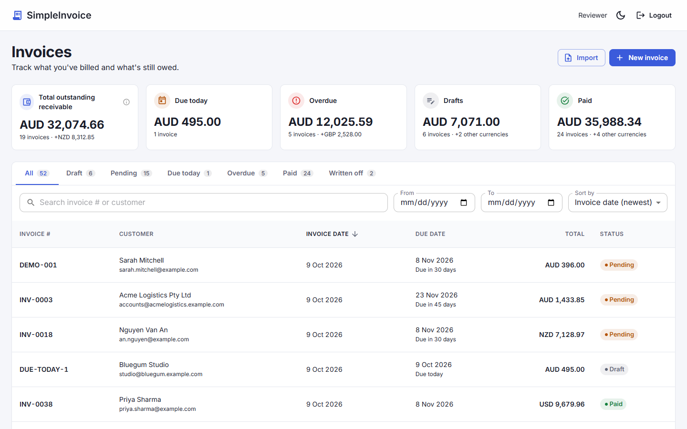

<details>
<summary>Dark mode, mobile and login</summary>

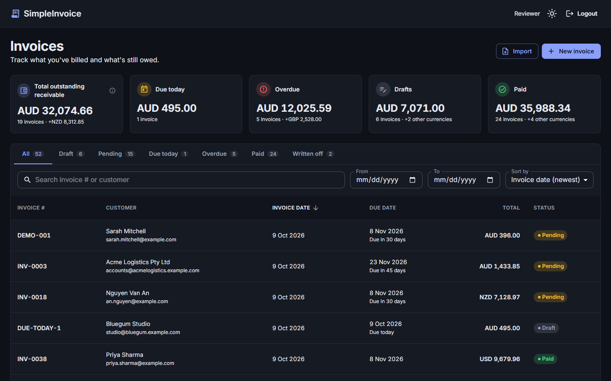

<p>
  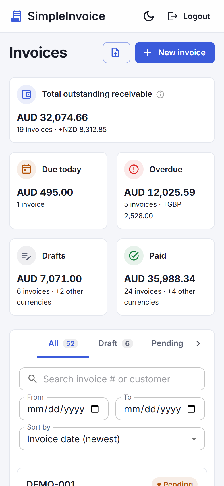
  &nbsp;
  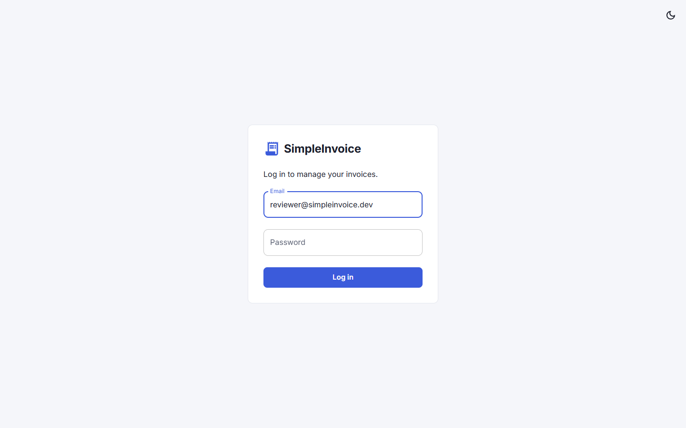
</p>

</details>

**Invoice detail:** the Appendix A invoice (part paid, now overdue) with payment progress, totals, payment history and the activity timeline.

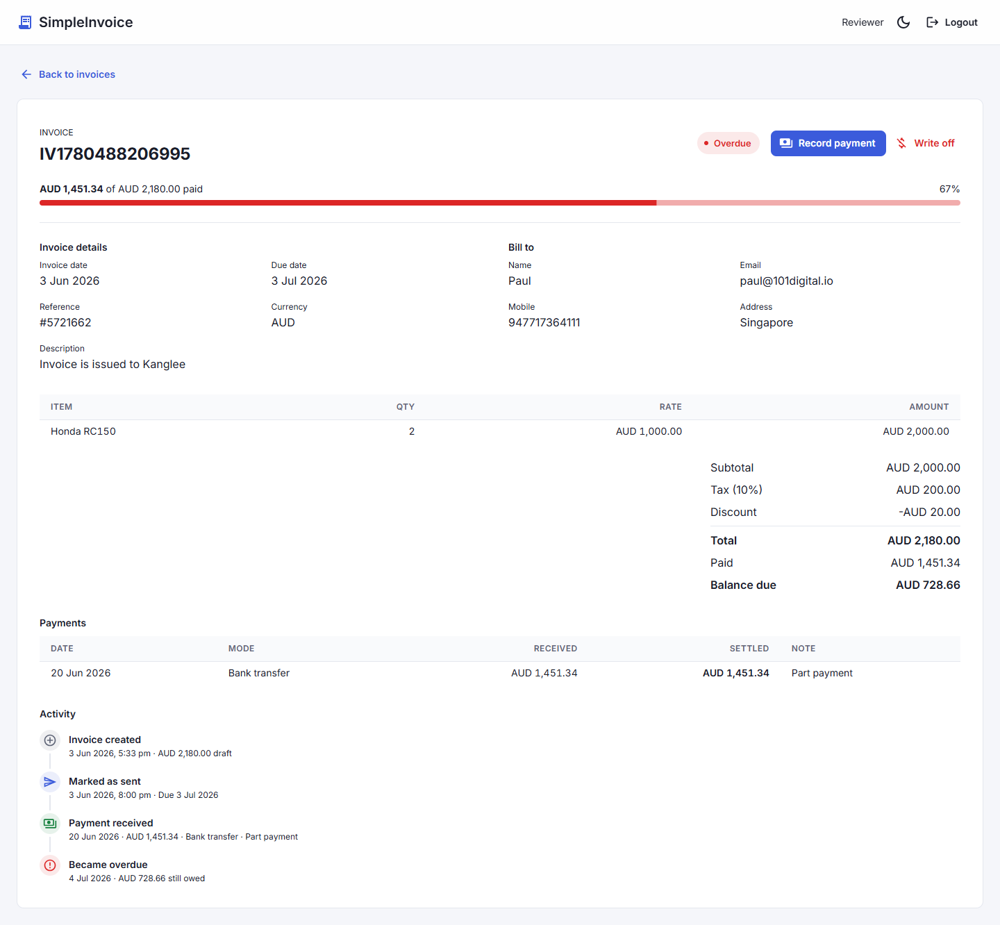

**Create invoice:** with Net 7/14/30/60 due dates and a live preview. The server recalculates the totals when you save.

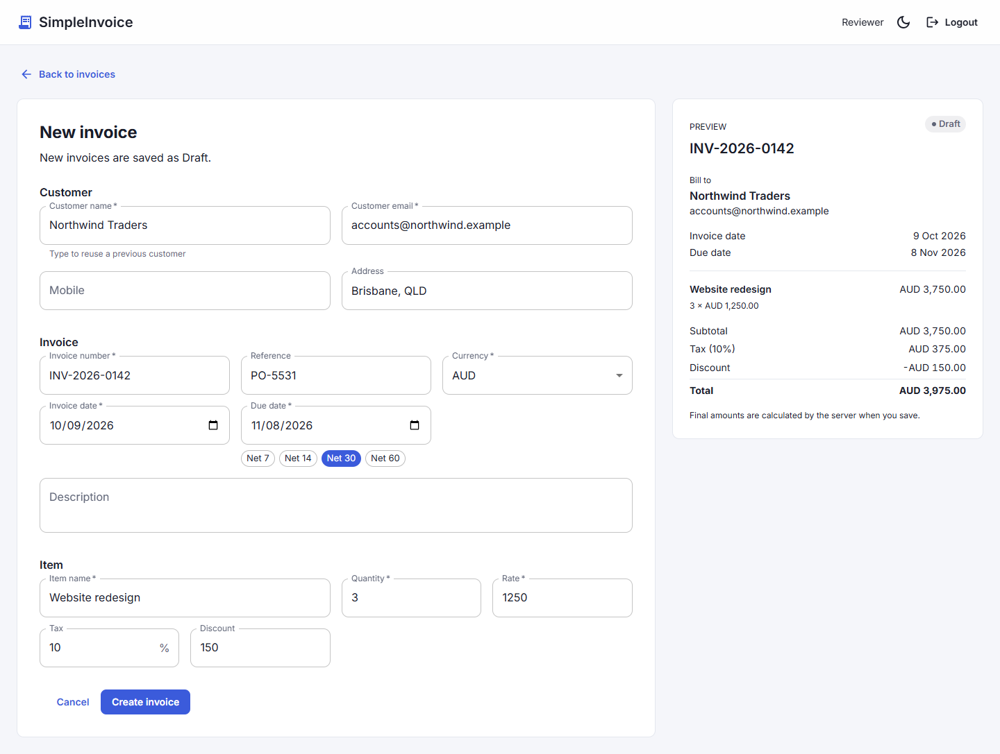

**Recording payments and write-offs:**

| Payment in USD, with tax withheld | Short payment, difference written off | Bad debt write-off |
| --- | --- | --- |
| 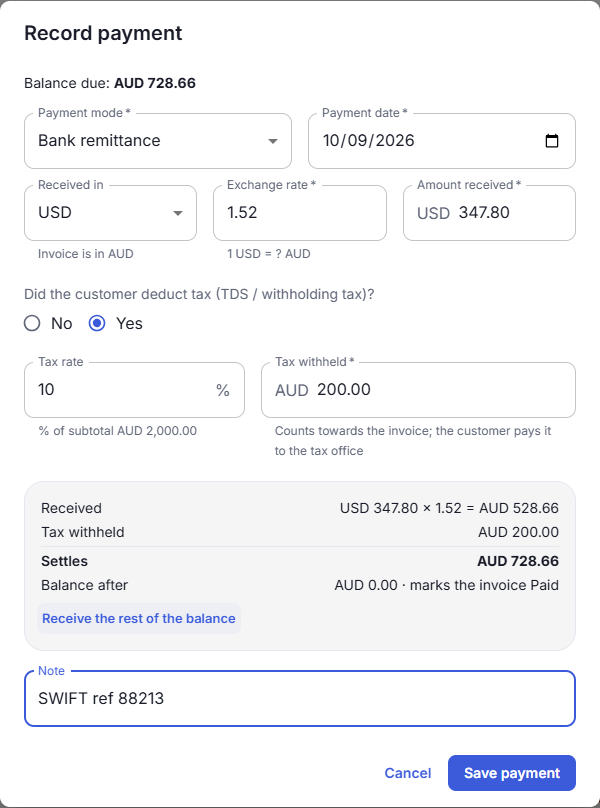 | 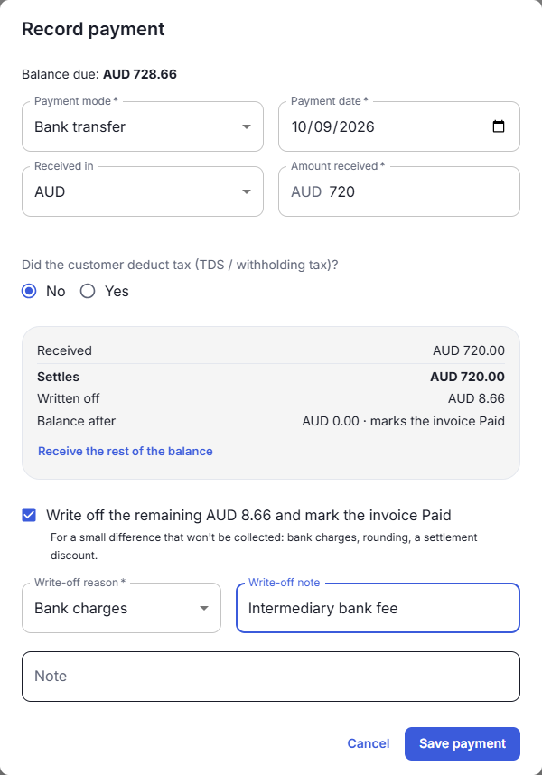 | 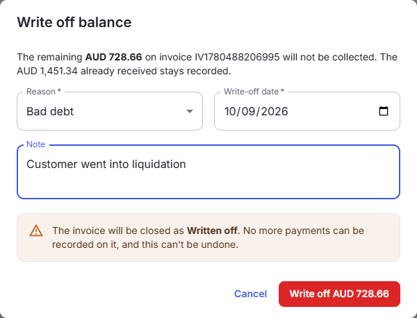 |

**A written-off invoice:** 500 paid, the remaining 985 written off as bad debt.

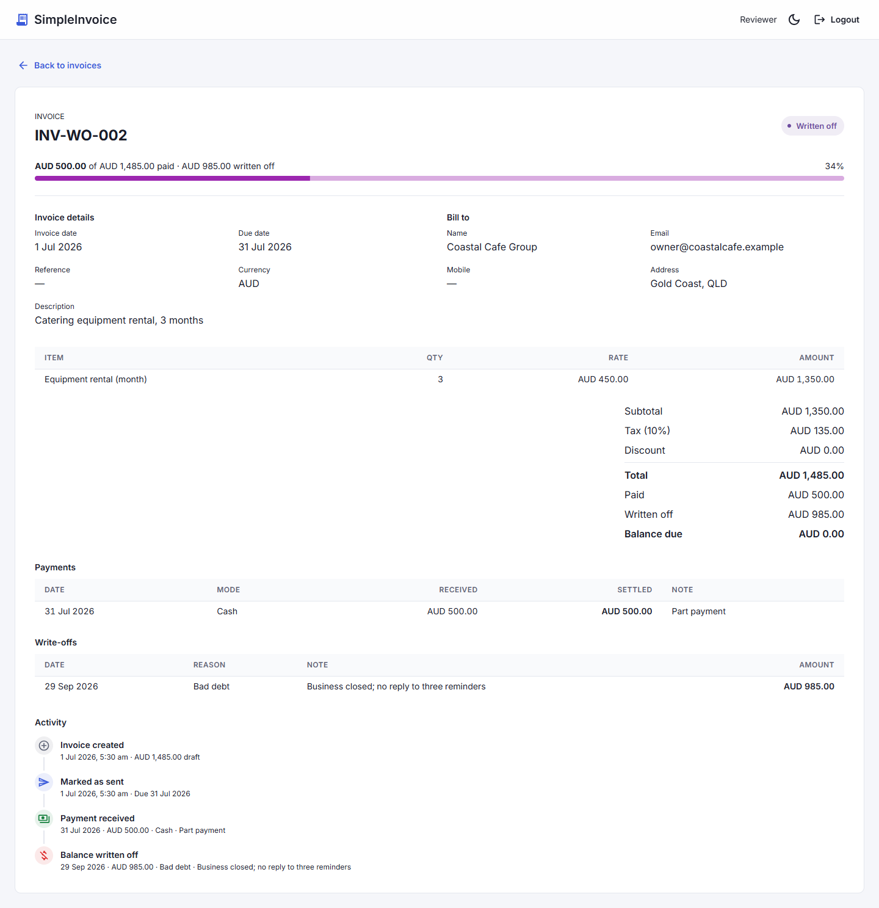

**Bulk import from Excel:** every row is checked before anything is saved. Rows with problems are skipped, and the rest are imported as Drafts.

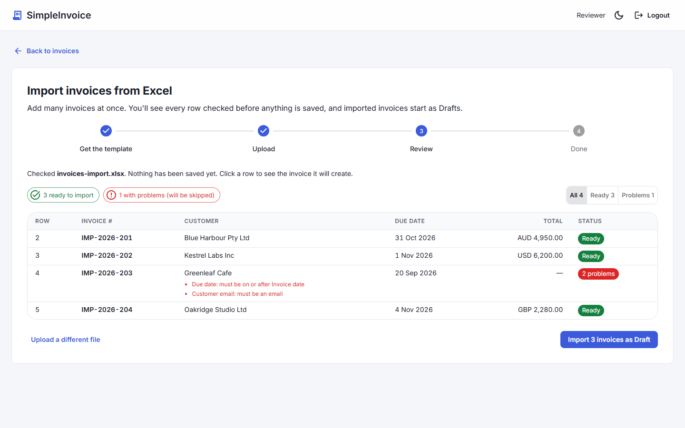

<table>
  <tr>
    <th>PDF of a paid invoice</th>
    <th>Swagger (<code>/api/docs</code>)</th>
  </tr>
  <tr>
    <td width="45%">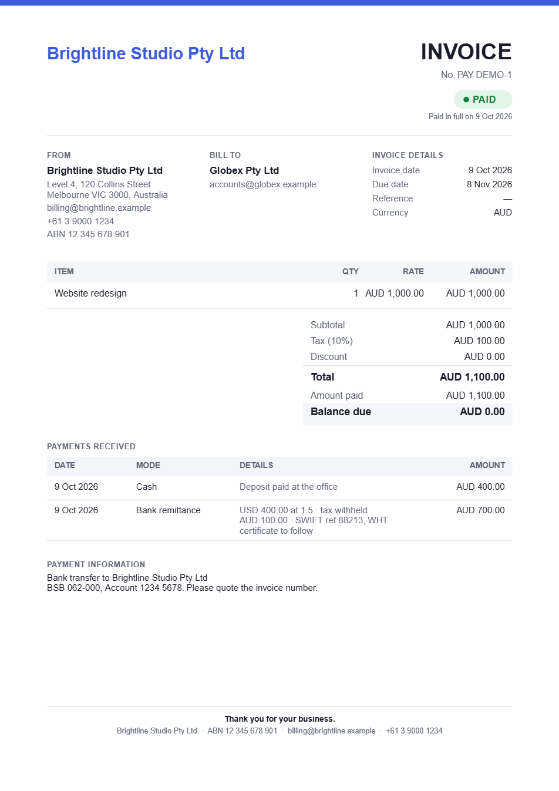</td>
    <td>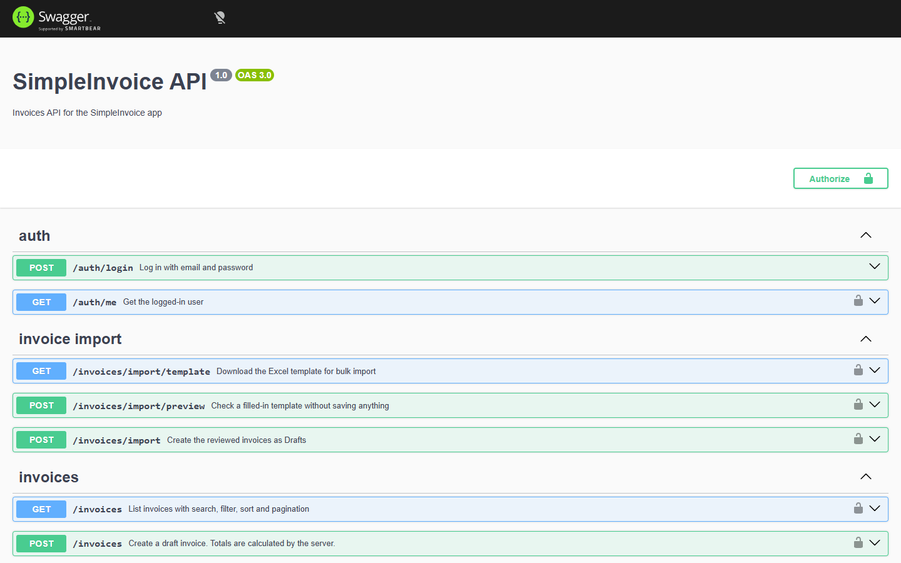</td>
  </tr>
</table>

---

## Running with Docker

```bash
cp .env.example .env        # sets JWT_SECRET (required) and the other settings
docker compose up --build
```

**`JWT_SECRET` is the only required setting.** Compose stops with `JWT_SECRET must be set in .env` if it's missing; change the example value for anything other than local use. Everything else (database password, seed login, ports, CORS origin) has a working default, and `.env.example` lists them all. On first start the backend applies the database migrations and seeds the data, so you can log in straight away.

| Service  | URL                            |
| -------- | ------------------------------ |
| App      | http://localhost:8080          |
| API      | http://localhost:3000          |
| Swagger  | http://localhost:3000/api/docs |
| Postgres | localhost:5432                 |

Ports can be changed in `.env` (`FRONTEND_PORT`, `BACKEND_PORT`, `DB_PORT`). To start again from an empty database: `docker compose down -v`.

**Your business details on PDF invoices.** The "From" block, footer and payment information on PDF invoices come from `COMPANY_*` variables in `.env`. The example values are a made-up business ("Brightline Studio Pty Ltd"), so replace them with your own:

| Variable | Shown as | Example |
| --- | --- | --- |
| `COMPANY_NAME` | Header, "From", footer | `Brightline Studio Pty Ltd` |
| `COMPANY_ADDRESS` | "From" (`\n` for a new line) | `Level 4, 120 Collins Street\nMelbourne VIC 3000` |
| `COMPANY_EMAIL`, `COMPANY_PHONE` | "From", footer | `billing@brightline.example` |
| `COMPANY_TAX_ID` | "From", footer, printed as written | `ABN 12 345 678 901` |
| `COMPANY_PAYMENT_DETAILS` | "Payment information" | bank name, BSB / account, reference |

Any of them can be left empty and that line is left out; without `COMPANY_NAME` the PDF says "SimpleInvoice". Restart the backend after changing them (`docker compose up -d backend`).

**Public address for link previews.** When you deploy, set `SITE_URL` (e.g. `https://invoices.example.com`) in `.env` and rebuild the frontend (`docker compose up --build -d frontend`), so shared links show the preview image. Locally it defaults to `http://localhost:8080`.

---

## Running without Docker

You need Node 20+ and PostgreSQL 14+. The quickest way to get just the database is `docker compose up db`.

```bash
# backend - http://localhost:3000, docs at /api/docs
cd backend
cp .env.example .env        # point DATABASE_URL at your database
npm install
npx prisma migrate deploy   # create the tables
npm run seed                # reviewer account + sample invoices
npm run start:dev
```

```bash
# frontend - http://localhost:5173
cd frontend
cp .env.example .env
npm install
npm run dev
```

The Vite dev server forwards `/api/*` to the backend, the same way nginx does in Docker, so no CORS setup is needed.

---

## Default Login

| Email                      | Password     |
| -------------------------- | ------------ |
| reviewer@simpleinvoice.dev | Password123! |

These come from `SEED_USER_EMAIL` / `SEED_USER_PASSWORD` in `.env`.

---

## Seeding

```bash
cd backend && npm run seed
```

The seed creates:

- the reviewer account
- the invoice from **Appendix A** of the brief (same ids and amounts)
- **40 generated invoices** with a mix of statuses, currencies, customers, amounts and dates
- a payment record for every paid or part-paid invoice
- two invoices closed with a write-off: **INV-WO-001** (paid, with USD 15 of bank charges written off) and **INV-WO-002** (part paid, the rest written off as bad debt)

The generated data uses a fixed random seed, so everyone gets the same invoices. Dates are relative to the day it runs, so there are always some overdue invoices and some still in date. It skips rows that already exist, so running it twice is safe. In Docker it runs on every start; set `SEED_ON_START=false` to turn that off.

---

## Testing

```bash
cd backend && npm test             # unit tests (95)
cd backend && npm run test:e2e     # end-to-end against a migrated database in DATABASE_URL (17)
cd frontend && npm test            # component and page tests (67)
```

The frontend runner is limited to 4 test files at a time (`maxWorkers` in `vite.config.ts`). Each file renders the whole MUI app in its own jsdom, and running them all at once made first renders slow enough to time out on an 8-core machine.

---

## API Summary

✚ = beyond the brief. Full schemas are in Swagger at `/api/docs`.

| Method | Path | Notes |
| --- | --- | --- |
| POST | /auth/login | public; returns `accessToken`, `expiresIn`, `user` |
| GET | /auth/me | current user |
| GET | /invoices | `page`, `pageSize`, `sortBy`, `ordering`, `status`, `keyword`, `fromDate`, `toDate` (✚ `dueToday`, `outstanding`) |
| GET | /invoices/:id | invoice with items (✚ payments, write-offs, `totalWrittenOff`, `storedStatus`, `sentAt`) |
| POST | /invoices | creates a Draft |
| ✚ PUT | /invoices/:id | edits a Draft |
| ✚ DELETE | /invoices/:id | deletes a Draft (204) |
| ✚ PATCH | /invoices/:id/status | `{ "status": "Pending" }`: mark as sent |
| ✚ POST | /invoices/:id/payments | `{ method, amountReceived, currency?, exchangeRate?, taxWithheld?, paidAt, note?, writeOffRest?, writeOffReason?, writeOffNote? }`; Paid once the balance is 0 |
| ✚ POST | /invoices/:id/write-off | `{ reason, writtenOffAt, note? }`; writes off the rest of the balance, invoice becomes WrittenOff |
| ✚ GET | /invoices/:id/pdf | PDF of a Paid invoice |
| ✚ GET | /invoices/stats | counts and amounts per status, plus `dueToday` and `outstanding` (same search/date filters as the list) |
| ✚ GET | /invoices/import/template | Excel template |
| ✚ POST | /invoices/import/preview | multipart `file` (.xlsx); checks rows, saves nothing |
| ✚ POST | /invoices/import | `{ invoices: [...] }`; creates Drafts, all or nothing |
| ✚ GET | /customers | `keyword`; previous customers for autofill |

Every error has the same shape:

```json
{ "statusCode": 404, "message": "Invoice not found", "error": "Not Found" }
```

| Code | When |
| --- | --- |
| 400 | validation failed (message is a list of problems), bad id, bad file |
| 401 | missing, invalid or expired token; wrong login |
| 404 | invoice not found |
| 409 | duplicate invoice number; action not allowed in the invoice's current status |

---

## Assumptions & Design Decisions

**Overdue is computed, never stored.** The `status` column only allows Draft, Pending, Paid and Written off. When an invoice is read, it's reported as Overdue if it isn't closed (Paid or Written off) and its due date is before today; an invoice due today isn't overdue yet. The **status filter uses the same rule**: `status=Pending` returns Pending invoices that are *not* past due, so the filter never returns rows that the table then labels Overdue. The Appendix A invoice is stored as Pending and shows as Overdue because its due date has passed.

**Overdue vs. receivable.** Because the brief defines Overdue as "not Paid and past due", an unsent Draft past its due date counts as Overdue. It is *not* part of the Total outstanding receivable, which only counts invoices that have been sent. So the Overdue card can include a little more than the overdue part of the receivable, and the receivable card's tooltip explains the difference.

**"Today" is in UTC**, so the backend doesn't depend on the server's timezone. For users far from UTC, an invoice can become Overdue a few hours before or after their local midnight.

**Money is calculated on the server with decimals.** Amounts are `NUMERIC(12,2)`, calculated with `Prisma.Decimal` and rounded half-up to 2 places:

```
subTotal      = quantity × rate
totalTax      = subTotal × taxRate / 100
totalAmount   = subTotal + totalTax − discount
balanceAmount = totalAmount − totalPaid
```

**Discount is a flat amount**, which is what the sample data shows (2000 + 200 − 20 = 2180). A discount bigger than subtotal + tax is rejected so totals can't go negative.

**`taxRate` is stored** (the brief only lists `totalTax`) so the invoice can show "Tax (10%)". **`sentAt` is stored** so the timeline can show when an invoice was sent.

**Customer details are stored on the invoice**, which the brief allows. An invoice keeps the details it was issued with, and there's no question of how to merge customers who share an email. Customer autocomplete reads the latest details per email from previous invoices.

**Invoice numbers are unique in the database.** The service checks first to give a clear 409, and also turns a unique-constraint violation (two requests at the same moment) into the same 409. The global exception filter also maps a duplicate key (Prisma `P2002`, or Postgres `23505` from a raw query) to 409, as a safety net for any other route.

**The token is stored in localStorage** with its expiry time and sent as a Bearer header. It survives page refreshes and works with Swagger. The trade-off is that an XSS bug could read it; an httpOnly cookie avoids that but needs CSRF protection. For this scope I chose the simpler option.

**Only Drafts can be edited or deleted.** A sent invoice has been seen by the customer, and changing it would need credit notes (out of scope).

**PDFs and Excel files are handled on the server**, so the output is the same for every client and both are covered by end-to-end tests.

**Supported currencies:** AUD, USD, GBP, EUR, SGD, NZD. Amounts are **displayed with the currency code** ("AUD 1,234.50") everywhere: cards, table, detail page, form preview, import review, the Excel template's notes and the PDF. Dollar currencies can't be confused that way (AU$ vs US$ vs NZ$). The invoice API still returns `currencySymbol`, as the brief's data model requires.

---

## Known Limitations

- One line item per invoice (as the brief specifies). The data model and API already allow more.
- Only Draft invoices can be edited or deleted (by design); payments and write-offs can't be edited or reversed, and there are no refunds or credit notes. A customer paying after a bad-debt write-off (a recovery) can't be recorded.
- Exchange rates are entered by hand; there is no rate feed.
- Bulk import: problem rows have to be fixed in Excel and re-uploaded; they can't be edited in the review table.
- PDF download is for Paid invoices only (as requested). Enabling it for sent invoices is a one-line change.
- No user registration or password reset; users come from the seed.
- The business details on the PDF come from `.env`, so there is one business per deployment and no settings screen to edit them.
- No refresh tokens: when the access token expires (default 1 hour) the user has to log in again.
- No rate limiting on the login endpoint.
- The end-to-end tests need a real Postgres; they don't start one themselves.

---

## Assessment requirements

How each requirement in the brief is met.

### 2.1 Core features

| Requirement | Status | Where / how |
| --- | --- | --- |
| **Login screen** with email + password | ✅ | `frontend/src/pages/LoginPage.tsx` |
| Client- and server-side validation of login | ✅ | Zod schema in the form; `LoginDto` with class-validator on the API |
| JWT issued and stored on the client | ✅ | `POST /auth/login` returns `accessToken`; stored with its expiry in localStorage (see [design decisions](#assumptions--design-decisions)) and sent as a Bearer header |
| All protected routes restricted; logged-out users redirected to login | ✅ | `ProtectedRoute` on the frontend; any 401 from the API logs the user out. On the backend the JWT guard is **global**, and only `/auth/login` and `/health` are public |
| **Invoice list** as the home screen after login | ✅ | `/invoices`; after login you return to the page you originally asked for |
| Shows Invoice No., Customer, Invoice date, Due date, Total, Status | ✅ | `InvoiceTable` (cards on mobile) |
| Search by number or customer, case-insensitive, partial | ✅ | `keyword` → `ILIKE` on both columns, with trigram indexes; the search box waits until you stop typing |
| Filter by Draft / Pending / Paid / Overdue | ✅ | Status tabs with counts (plus ✚ a Due today tab) and clickable summary cards; see [Overdue logic](#assumptions--design-decisions) |
| Sort by invoiceDate / dueDate / totalAmount, ASC/DESC | ✅ | Column headers and a sort menu |
| Server-side pagination, configurable page size | ✅ | `page` / `pageSize` (5, 10, 20, 50; API max 100) |
| **Invoice detail**: invoice, customer, items, subtotal, tax, discount, total, balance, status | ✅ | `InvoiceDetailPage` |
| **Create invoice** screen | ✅ | `CreateInvoicePage` / shared `InvoiceForm` |
| Exactly one line item (model allows more) | ✅ | `items` array with `@ArrayMinSize(1) @ArrayMaxSize(1)`; separate `invoice_items` table |
| New invoices are always Draft | ✅ | Set on the server; the client can't choose it |
| Invoice number user-provided and unique | ✅ | Unique DB index plus a friendly 409 |
| All field rules (required fields, email, due ≥ invoice date, currency, quantity positive integer, rate positive, tax ≥ 0 default 10, discount ≥ 0 default 0) | ✅ | `CreateInvoiceDto` (server) and the Zod schema (client) |
| Success notification, then redirect to the list | ✅ | Snackbar "Invoice X created" |
| Total calculated by the backend | ✅ | `invoice-calculator.ts`; the client never sends totals |

### 2.2 Frontend

| Requirement | Status | Where / how |
| --- | --- | --- |
| React + TypeScript | ✅ | Vite + React 19 + strict TypeScript |
| Responsive (mobile + desktop) | ✅ | Full-width layout on desktop; card layout and stacked filters on phones. Checked at 375px and 1880px wide with no horizontal scrolling |
| Clean, documented code | ✅ | Small components and hooks; comments explain *why* |
| Unit tests for key flows and components | ✅ | 67 tests: login, list, detail, create, lifecycle, payments, write-offs, edit/delete, import, extras, theme, page titles |

### 2.3 Backend

| Requirement | Status | Where / how |
| --- | --- | --- |
| NestJS + TypeScript REST API | ✅ | Modules: `auth`, `invoices` (+ `import`), `customers`, `database`, `common`, `config` |
| PostgreSQL | ✅ | Prisma schema and migrations in `backend/prisma` |
| `POST /auth/login`, `GET /auth/me` | ✅ | `auth.controller.ts` |
| `GET /invoices` with page, pageSize, sortBy, ordering, status, keyword, fromDate, toDate | ✅ | `ListInvoicesQueryDto`; invalid values give a 400 |
| Response shape `{ data, paging: { page, pageSize, total } }` | ✅ | |
| `GET /invoices/:id`, `POST /invoices` | ✅ | Non-UUID id → 400, unknown → 404 `"Invoice not found"` |
| **Business logic:** subTotal, tax, total, balance on the server | ✅ | Decimal arithmetic (no floating-point errors), rounded half-up to 2 places |
| Unique invoice number **at database level** | ✅ | Unique index; a unique-constraint violation also becomes a 409 |
| Due date ≥ invoice date validated server-side | ✅ | `@IsOnOrAfter('invoiceDate')` plus a database CHECK constraint |
| **Overdue derived at read time, never stored** | ✅ | The DB enum has Draft, Pending, Paid and ✚ WrittenOff, never Overdue; `deriveStatus()` and a matching `statusFilter()` |
| JWT auth guard on all `/invoices` endpoints | ✅ | Global guard |
| Token expiry from env, default 3600s | ✅ | `JWT_EXPIRES_IN` (validated at startup) |
| Default user seeded, credentials in README | ✅ | See [Default Login](#default-login) |
| **Seed script** from Appendix A + 20–50 extra varied invoices, `npm run seed` | ✅ | 1 + 42 invoices (40 generated, 2 write-off examples); see [Seeding](#seeding) |
| class-validator + ValidationPipe, structured 400s | ✅ | `{ statusCode: 400, message: [...], error: "Bad Request" }` |
| Global exception filter, consistent errors | ✅ | `AllExceptionsFilter`, which also hides internal errors behind a plain 500 and maps duplicate keys (Prisma `P2002`, Postgres `23505`) to 409 |
| **Tests:** totals, Overdue, due-date validation, unique numbers | ✅ | `invoice-calculator.spec`, `invoice-status.spec`, `create-invoice.dto.spec`, `invoices.service.spec` |
| At least one e2e test of a key flow | ✅ | `test/invoices.e2e-spec.ts`: log in → create → find it in the list (and 16 more) |
| Swagger at `/api/docs`, all endpoints, payloads, params, responses and codes | ✅ | `@nestjs/swagger`; bearer auth via the "Authorize" button |

### 2.4 Architecture

| Requirement | Status | Where / how |
| --- | --- | --- |
| Monorepo or two repos (documented) | ✅ | Monorepo: `backend/`, `frontend/`, `docker-compose.yml` |
| `docker-compose.yml` starts frontend, backend and DB with one command | ✅ | Health checks; the backend applies migrations and seeds on start |
| A Dockerfile per service | ✅ | Multi-stage Node 20 build; nginx serves the frontend and forwards `/api` |
| Ports documented | ✅ | [Running with Docker](#running-with-docker) |
| `.env` config, `.env.example` without real secrets, nothing hardcoded | ✅ | Root, backend and frontend `.env.example`; env vars validated at startup |

### 3. Data model

| Entity | Status | Notes |
| --- | --- | --- |
| Invoice: all fields in the brief (`invoiceId` … `createdBy`) | ✅ | Plus `taxRate` and `sentAt` (see below) |
| Customer: embedded **or** separate table | ✅ | **Embedded** on the invoice (reasoning under design decisions) |
| Invoice Item: id, invoiceId FK, name, quantity, rate | ✅ | Cascade delete with the invoice |
| User: id, email (unique), passwordHash (bcrypt), fullname, createdAt | ✅ | |

### 4.2 Deliverables (README contents)

Overview and architecture ✅ · running with and without Docker ✅ · login details ✅ · seed instructions ✅ · assumptions and design decisions ✅ · known limitations ✅

---

## Beyond the brief

Features and improvements that weren't required. Each is covered by backend and frontend tests.

### 1. Invoice lifecycle: Draft → Pending → Paid / Written off

The brief only creates Drafts. Here invoices can move on:

- **Mark as sent** (`PATCH /invoices/:id/status`): Draft → Pending. It records `sentAt`.
- **Record payment** (`POST /invoices/:id/payments`): adds to `totalPaid` and lowers the balance. When the balance reaches 0 the invoice **becomes Paid automatically**. Paid can't be set by hand, so the status always matches the money.
- A **payment history** is stored in a new `payments` table.
- **Payment details** in the Record payment dialog:
  - **Payment mode:** Bank transfer, Cash or Bank remittance.
  - **Received in another currency:** pick the currency the money arrived in and the exchange rate (1 USD = ? AUD). The amount is converted to the invoice currency, rounded half up to cents. A foreign payment without a rate, or a same-currency payment with a rate other than 1, gives a 400.
  - **Tax deducted (Yes/No):** if the customer withheld tax (TDS / withholding tax), enter it as an amount or as a % of the subtotal. Withheld tax counts towards the invoice, because the customer pays it to the tax office for you; it is stored separately so it can be reconciled.
  - The invoice is settled by `amount received × rate + tax withheld`. A live summary shows this, and the balance left, before saving; "Receive the rest of the balance" works the amount out backwards.
  - The payment history, the activity timeline and the PDF show the mode, the original amount and rate, and the tax withheld.
  - Existing payments were backfilled by the migration (Bank transfer, invoice currency, rate 1), and a CHECK constraint keeps `amount = ROUND(amount_received × exchange_rate, 2) + tax_withheld`.
- Not allowed (409): paying a Draft, paying a Paid invoice, moving backwards. Overpaying, or paying before the invoice date, gives a 400.
- **Safe when two requests arrive at once:** the payment locks the invoice row, so two payments sent together can't overpay (tested end to end).
- **Write-offs**, for money that will never be collected. Two kinds:
  - **Bad debt: write off the rest of the balance** (`POST /invoices/:id/write-off`). A **Write off** button sits next to Record payment on Pending and Overdue invoices. Choose a reason (Bad debt, Dispute, or Other with a note), a date and an optional note. Payments already received stay; the remaining balance is written off and the invoice moves to a new **Written off** status.
  - **Short payment: write off the small difference.** In Record payment, when the amount settles less than the balance, a "Write off the remaining AUD 6.00 and mark the invoice Paid" option appears, for bank charges, exchange differences, rounding or a settlement discount. The difference is written off with that reason, linked to the payment, and the invoice becomes **Paid**: the money was received, just not quite all of it.
  - **Written off** is a closed status like Paid: no more payments or write-offs (409), never Overdue, left out of Total outstanding receivable and Due today, and it has its own status tab. Its stats amount is the total written off.
  - Stored in a new `write_offs` table (amount, reason, note, date, the payment it belongs to if any). The invoice gets `totalWrittenOff`, and the balance is now `total − paid − written off`. CHECK constraints enforce that sum, a non-negative balance, and a zero balance on Paid and Written off invoices.
  - The detail page shows a "Written off" line in the totals and on the progress bar, a Write-offs table, and the write-off in the activity timeline. On the PDF it appears in the totals and in a "Payments and write-offs" table.

### 2. Edit and delete Draft invoices

- `PUT /invoices/:id` (same body as create, totals recalculated) and `DELETE /invoices/:id` (204).
- **Drafts only.** Once sent, an invoice shouldn't change quietly, so Pending and Paid invoices get a 409.
- Create and edit share one form; delete asks for confirmation.

### 3. Download paid invoices as PDF

- `GET /invoices/:id/pdf` builds an A4 invoice on the server with `pdfkit`, laid out like a real invoice:
  - **Header:** the business name; "INVOICE" with the number; a green **PAID** status pill (the same style as in the web app) with "Paid in full on …" ("Settled on …" when part of it was written off).
  - **From / Bill to / Invoice details** in three columns: your business (address, email, phone, tax ID), the customer, and the dates, reference and currency.
  - The description, the item table, and totals ending with a highlighted **Balance due**.
  - **Payments received:** date, mode, details (foreign amount and rate, tax withheld, note) and amount.
  - **Payment information** (your bank details) and a footer with the business name, tax ID and contact details.
- The business details are configuration (`COMPANY_*` in `.env`, see Running with Docker), not hard-coded.
- Amounts use currency codes ("USD 9,679.96") like the rest of the app. Only the built-in Helvetica font is used, so no extra system packages are needed in the Docker image.
- Paid invoices only (409 otherwise). A "Download PDF" button appears on paid invoices.

### 4. Bulk import from Excel

1. **Download template** (`GET /invoices/import/template`): required columns highlighted, hover notes, in-cell checks (a currency dropdown, dates, numbers), and an Instructions sheet.
2. **Upload** (`POST /invoices/import/preview`): the server reads the file and checks **every row with the same rules as the create form**, plus duplicates within the file and against existing invoices. **Nothing is saved.**
3. **Review:** problem rows first, with plain-language reasons per column ("Customer email: must be an email", "Item name: is required"). Click any row to preview the invoice it will create.
4. **Import** (`POST /invoices/import`): the server re-checks the valid rows and creates them in **one transaction** as Drafts, all or nothing. Invalid rows are skipped and listed so they can be fixed in Excel and re-uploaded.

Amounts (Rate, Discount) are in the invoice currency given by the **currency code** in the Currency column; the template formats them as `1,234.50` and says not to use symbols. Amounts copied from the app ("AUD 1,234.50") are accepted too, and an amount in a different currency than the row ("USD 180" on an AUD invoice) is reported as a problem rather than guessed.

It handles real Excel files: date cells, emails stored as hyperlinks, phone numbers stored as numbers, formulas (only their saved results are read; nothing is executed), blank rows, and columns in any order. Limits: `.xlsx` only, 2 MB, 200 invoices per file. Tested with a file saved by Microsoft Excel.

### 5. Dashboard and UI

- **Summary cards:** Total outstanding receivable, Due today, Overdue, Drafts and Paid. Each shows an amount (per currency, e.g. "AUD 32,074.66 · +NZD 8,312.85") and a count. Every card is clickable and filters the table; clicking it again goes back to All.
- **Total outstanding receivable:** money customers still owe on invoices that have been **sent** and aren't fully paid, whether due later, today or overdue. Drafts are left out, even overdue ones, because nobody owes money on an invoice that hasn't been sent. An ⓘ tooltip explains this, and screen readers get the same text as the card's description. Clicking it filters the table (`outstanding=true`); no tab is highlighted, because no single tab shows exactly that set.
- **Due today:** unpaid invoices whose due date is today. They aren't Overdue yet (that starts tomorrow), so they're the ones worth chasing now. It has a card and its own tab: All · Draft · Pending · **Due today** · Overdue · Paid · Written off.
- **Status tabs with live counts.** `GET /invoices/stats` applies the same Overdue rule and the same search and date filters as the list, so a tab's count always equals what you see when you click it (tested end to end).
- **Which filters affect what:** choosing a view (a status tab, Due today or Outstanding, from a tab or a card) filters only the **table**; the cards and tab counts keep showing the overall figures. The search box and the From/To dates narrow the table, the cards and the tab counts together.
- **Full-width layout** on large screens, so the six-column table has room; phones get cards and stacked filters.
- **No sideways scrolling at any screen size** (checked at desktop 1440 px, tablet 768 px and phone 375 px). The screen-reader-only description on the Total outstanding receivable card used to be as wide as the page and caused a horizontal scrollbar: in MUI's `sx`, `width: 1` means 100%, not 1 px. It now uses explicit `'1px'` sizes and the standard visually-hidden styles.
- **Light and dark themes**: follows the OS setting until you use the toggle, then remembers your choice. The Inter font is bundled, so it works offline.
- **Skeleton loading** states and helpful **empty states** (no invoices yet, nothing overdue, no search results).
- **Relative due hints** ("Due in 3 days", "Due today", "12 days overdue").
- **List filters live in the URL**, so refresh, the back button and shared links keep the current view.

### 6. Detail page extras

- **Payment progress bar** ("AUD 1,451.34 of AUD 2,180.00 paid, 67%").
- **Activity timeline:** created → sent → payments → became overdue / paid in full.

### 7. Form extras

- **Customer autocomplete** from previous invoices (`GET /customers`); picking one fills in email, mobile and address.
- **Net 7 / 14 / 30 / 60** buttons for the due date.
- **Live invoice preview** beside the form on wide screens, with an estimated total. The server still calculates the saved amounts.

### 8. Database and API hardening

- **CHECK constraints** the API doesn't rely on but the database enforces anyway: due date ≥ invoice date, non-negative amounts, quantity > 0, rate > 0, tax 0–100, payment amount > 0, exchange rate > 0, tax withheld ≥ 0, settled amount = converted amount + tax withheld, write-off amount > 0, balance = total − paid − written off and ≥ 0, zero balance on Paid / Written off, `sentAt` consistent with status.
- **Indexes** for every sort and filter, plus **trigram GIN indexes** so the partial, case-insensitive search stays fast.
- **Every route needs a token by default** (global guard); environment variables are checked at startup; `/health` endpoint for Docker health checks.

### 9. SEO, link previews and performance

SimpleInvoice is a private, login-only app, so "SEO" here means three things. First, keep everything except the login page **out of search engines**. Second, make a shared link **look good** in Slack, LinkedIn or email. Third, score well in **Lighthouse**.

**Lighthouse, login page** (before → after):

| | Performance | Accessibility | Best Practices | SEO |
| --- | --- | --- | --- | --- |
| Mobile (simulated slow 4G, slower CPU) | 56 → **85–88** | 100 → **100** | 100 → **100** | 82 → **100** |
| Desktop | **100** | **100** | **100** | **100** |

On mobile, first paint went from 6.2 s to 2.5 s and the download from 1,004 KB to 276 KB.

- **Indexing:** `robots.txt` allows only `/login`. nginx also sends `X-Robots-Tag: noindex, nofollow` on every other page and on the API, so a direct link to an invoice is never indexed either.
- **Meta tags:** description, `theme-color` for light and dark mode, and **Open Graph / Twitter card** tags with a 1200×630 preview image (`frontend/public/og-image.png`). Scrapers need absolute URLs, so the build fills them in from `SITE_URL` (defaults to `http://localhost:FRONTEND_PORT`).
- **Page titles:** "Invoices · SimpleInvoice", "Invoice INV-0038 · SimpleInvoice", "New invoice · SimpleInvoice", and so on, for browser tabs, history and screen readers.
- **Installable:** a web app manifest, maskable icons and an Apple touch icon, so the app can be added to a phone's home screen.
- **Performance:**
  - **gzip** in nginx: about 975 KB of JavaScript becomes about 250 KB on the wire.
  - **Pages behind the login load on demand** (`React.lazy`), so the login page doesn't download the list, forms, dialogs or import screens.
  - **Libraries are split into long-cached files** (React, MUI core, data libraries, form validation), so an app deploy doesn't make users download React again. zod is only loaded by the invoice forms; the login form uses react-hook-form's built-in rules.
  - `index.html` is always re-checked (`Cache-Control: no-cache`) while hashed assets are cached for a year, so new deploys show up immediately.
